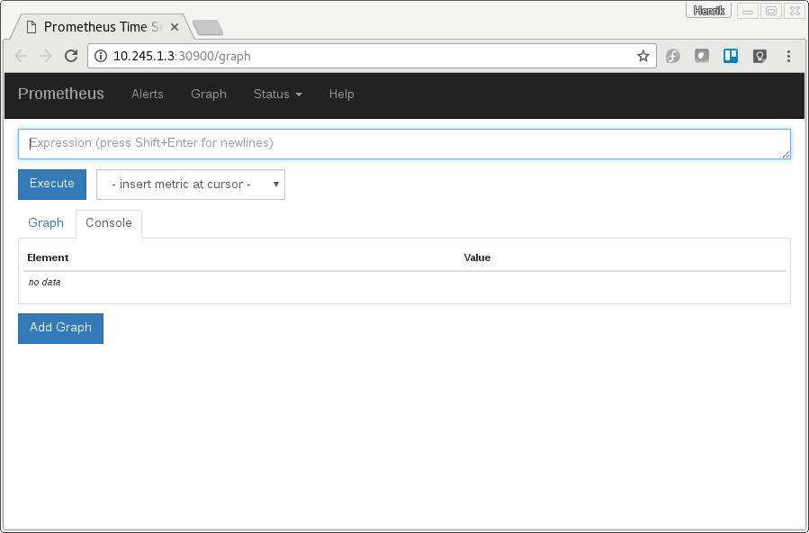
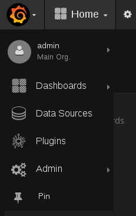
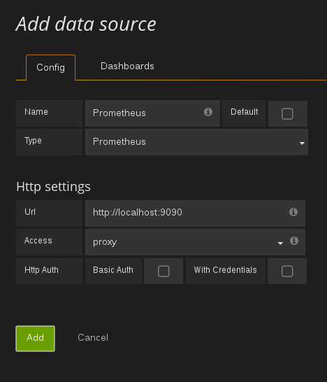
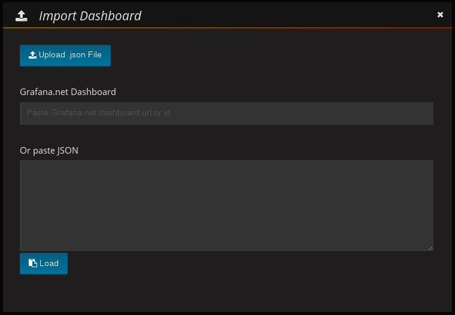
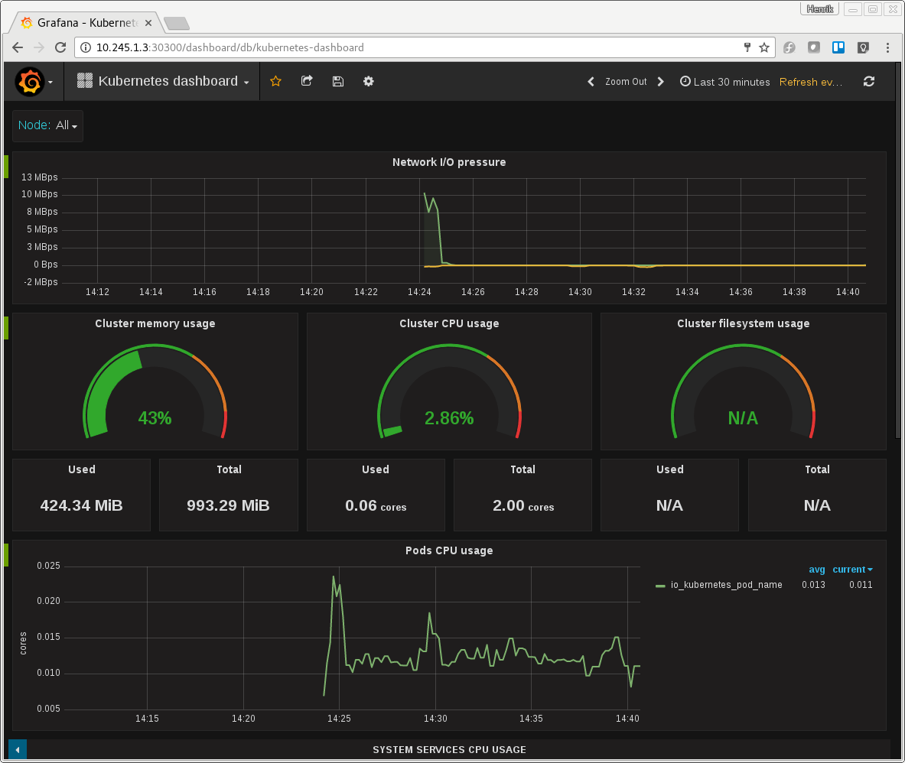

# PrometheusGrafana
This is a repository for the demo at the christmas workshop. People have asked for it as a repository. :) 


# Deploying Prometheus and Grafana in a Kubernetes cluster

## Preparing our Prometheus configuration
TODO - Sofar use the one we supply in deployment/prometheus-configmap.yaml

## Deploying
Running the file prom_graf.sh will do the following :
```
#!/bin/bash
kubectl create -f deployment/prometheus-configmap.yaml
kubectl create -f deployment/prometheus-deployment.yaml
kubectl create -f deployment/node-exporter.yaml
kubectl create -f deployment/grafana-deployment.yaml
kubectl create -f deployment/pushgateway-deployment.yaml

```

It will give you the following deployments:
```
[hoeghh@localhost prometheus-grafana]$ kubectl get deployments
NAME          DESIRED   CURRENT   UP-TO-DATE   AVAILABLE   AGE
grafana       1         1         1            1           58s
prometheus    1         1         1            1           58s
pushgateway   1         1         1            1           57s
```

And the following services, exposed as NodePort:
```
NAME            CLUSTER-IP       EXTERNAL-IP   PORT(S)    AGE
grafana         10.247.58.75     <nodes>       3000/TCP   1m
node-exporter   None             <none>        9100/TCP   1m
prometheus      10.247.156.178   <nodes>       9090/TCP   1m
pushgateway     10.247.187.134   <nodes>       9091/TCP   1m
```

## Accessing Prometheus in a browser
First we need to find the NodePort that Prometheus is listening on:
```
[hoeghh@localhost prometheus-grafana]$ kubectl describe service prometheus | grep NodePort
Type:			NodePort
NodePort:		prometheus	30900/TCP
```

We can see here, that it is listening on port 30900. Now we can acces it via an ip of one of the worker nodes.

First we find a worker nodes:
```
[hoeghh@localhost prometheus-grafana]$ kubectl get nodes
NAME                STATUS    AGE
kubernetes-node-1   Ready     23m
```

Now if you have multible nodes, pick one and run the following:
```
kubectl describe node kubernetes-node-1 | grep Addresses
Addresses:		10.245.1.3,10.245.1.3
```

Now we can access Prometheus via a browser on http://10.245.1.3:30900



## Accessing Grafana in a browser
Like Prometheus, we need to find the NodePort for the service.
```
[hoeghh@localhost prometheus-grafana]$ kubectl describe service grafana | grep NodePort
Type:			NodePort
NodePort:		grafana	30300/TCP
```

We know the ip of a workernode from before, so now we can access Grafana via http://10.245.1.3:30300

The username and password is by default "admin/admin"


## Setting up connection between Prometheus and Grafana
In Grafana, click on the top left icon and choose Data Sources.




Click the green "+Add data source" button in the right side of the screen.

Give your datasource a name, like "Prometheus" and in the type dropdown, choose "Prometheus". In the Http settings section, enter the url to Prometheus we got earlier on "http://10.245.1.3:30900/" and click the green "Add" button.

> NOTE : You can use the cluster DNS that points to Prometheus as URL instead. It will be http://prometheus.default.svc.cluster.local:9090. It properbly best to do so.



## Importing a Dashboard in grafana
Now we have Prometheus as a datasource for Grafana. Lets add a dashboard.

Click the menu button on the top left of Grafana, and click "Dashboards -> Import"



Now click the blue button "Upload .json File" and choose the file from our repository "/kubernetes/prometheus-grafana/dashboards/kubernetes-cluster-monitoring-via-prometheus_rev1.json". Give it a better name under Options and in the dropdown below, choose "Prometheus" as our datasource.

Now click the green "Save & Open" button.

You should now see the dashboard with metrics from Prometheus on our Kubernetes cluster like this :



## Future work
* We need to build the right dashboard, not just the one supplied here.
* We need to setup Alert rules in Prometheus.
